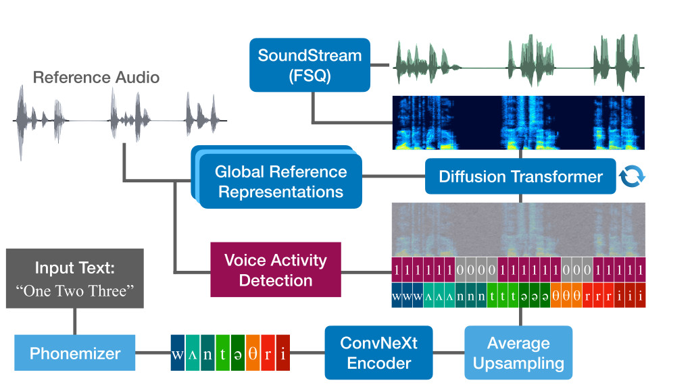

<html>
    <body>
    

    <h2>Abstract</h2>
    
Automatic lip-synchronous dubbing requires a speech synthesis model to generate alternating voice and silence patterns
    that match the timing of the original clip to ensure the best user experience. So far, this problem has been addressed by conditioning the speech synthesis process on lip movements extracted from the video signal. In this work, we condition speech generation on binary voice-activity signal, which has a lightweight representation and can be obtained in multiple ways, and show that the model follows the signal with high accuracy.

    

        
    

    <h2>Demo samples from the subjective listening test</h2>
    <table style='width: 100%;'>
        <thead>
            <tr>
                <th>Source Language</th>
                <th>Source Audio</th>
                <th>English Translation</th>
                <th>Generated</th>
            </tr>
        </thead>
        <tbody>
            <tr>
                    <td>pt</td>
                    <td><audio controls preload="none"><source src="resources/audios/sources/pt-pt_344_MwRGd5YN9oo.mp3" type="audio/mpeg">Your browser does not support the audio element.</audio></td>
                    <td>Today I&#x27;m organizing a co-operative society where I want to give opportunity for other inmates, for young people who come from correctional institutes.</td>
                    <td><h4>LibriTTS (no VAD)</h4><audio controls preload="none"><source src="resources/audios/libritts_no_vad/pt-pt_344_MwRGd5YN9oo.mp3" type="audio/mpeg">Your browser does not support the audio element.</audio>
                    <h4>LibriTTS (VAD)</h4><audio controls preload="none"><source src="resources/audios/libritts_vad/pt-pt_344_MwRGd5YN9oo.mp3" type="audio/mpeg">Your browser does not support the audio element.</audio>
                    <h4>Multilingual (VAD)</h4><audio controls preload="none"><source src="resources/audios/multi_vad/pt-pt_344_MwRGd5YN9oo.mp3" type="audio/mpeg">Your browser does not support the audio element.</audio></td>
                </tr>
                <tr>
                    <td>pt</td>
                    <td><audio controls preload="none"><source src="resources/audios/sources/pt-pt_1044_gMWud6IZQ3A.mp3" type="audio/mpeg">Your browser does not support the audio element.</audio></td>
                    <td>I would like to end with this message from Madiba, that synthesizes all what I think as an educator.</td>
                    <td><h4>LibriTTS (no VAD)</h4><audio controls preload="none"><source src="resources/audios/libritts_no_vad/pt-pt_1044_gMWud6IZQ3A.mp3" type="audio/mpeg">Your browser does not support the audio element.</audio>
                    <h4>LibriTTS (VAD)</h4><audio controls preload="none"><source src="resources/audios/libritts_vad/pt-pt_1044_gMWud6IZQ3A.mp3" type="audio/mpeg">Your browser does not support the audio element.</audio>
                    <h4>Multilingual (VAD)</h4><audio controls preload="none"><source src="resources/audios/multi_vad/pt-pt_1044_gMWud6IZQ3A.mp3" type="audio/mpeg">Your browser does not support the audio element.</audio></td>
                </tr>
                <tr>
                    <td>el</td>
                    <td><audio controls preload="none"><source src="resources/audios/sources/el-el_40_RYIDcSD5PNI.mp3" type="audio/mpeg">Your browser does not support the audio element.</audio></td>
                    <td>I wonder if we have ever recognized in ourselves reasons for someone to love us? And I don&#x27;t mean a description like, &quot;Tall, blonde, with blue eyes&quot; or &quot;Tall, strong, and manly&quot; and these kinds of things</td>
                    <td><h4>LibriTTS (no VAD)</h4><audio controls preload="none"><source src="resources/audios/libritts_no_vad/el-el_40_RYIDcSD5PNI.mp3" type="audio/mpeg">Your browser does not support the audio element.</audio>
                    <h4>LibriTTS (VAD)</h4><audio controls preload="none"><source src="resources/audios/libritts_vad/el-el_40_RYIDcSD5PNI.mp3" type="audio/mpeg">Your browser does not support the audio element.</audio>
                    <h4>Multilingual (VAD)</h4><audio controls preload="none"><source src="resources/audios/multi_vad/el-el_40_RYIDcSD5PNI.mp3" type="audio/mpeg">Your browser does not support the audio element.</audio></td>
                </tr>
                <tr>
                    <td>el</td>
                    <td><audio controls preload="none"><source src="resources/audios/sources/el-el_585_eFJy2q6F89Q.mp3" type="audio/mpeg">Your browser does not support the audio element.</audio></td>
                    <td>What are the obligations of countries in which refugees arrive? They have the obligation to respect their right to live when it is perfectly clear that by sending them back home, they send them back to death.</td>
                    <td><h4>LibriTTS (no VAD)</h4><audio controls preload="none"><source src="resources/audios/libritts_no_vad/el-el_585_eFJy2q6F89Q.mp3" type="audio/mpeg">Your browser does not support the audio element.</audio>
                    <h4>LibriTTS (VAD)</h4><audio controls preload="none"><source src="resources/audios/libritts_vad/el-el_585_eFJy2q6F89Q.mp3" type="audio/mpeg">Your browser does not support the audio element.</audio>
                    <h4>Multilingual (VAD)</h4><audio controls preload="none"><source src="resources/audios/multi_vad/el-el_585_eFJy2q6F89Q.mp3" type="audio/mpeg">Your browser does not support the audio element.</audio></td>
                </tr>
                <tr>
                    <td>el</td>
                    <td><audio controls preload="none"><source src="resources/audios/sources/el-el_1078_BbYgaeEuDXM.mp3" type="audio/mpeg">Your browser does not support the audio element.</audio></td>
                    <td>I am already doing my fourth session without even being aware of it.&quot; I realized that she didn&#x27;t want to talk, and I didn&#x27;t want to be annoying.</td>
                    <td><h4>LibriTTS (no VAD)</h4><audio controls preload="none"><source src="resources/audios/libritts_no_vad/el-el_1078_BbYgaeEuDXM.mp3" type="audio/mpeg">Your browser does not support the audio element.</audio>
                    <h4>LibriTTS (VAD)</h4><audio controls preload="none"><source src="resources/audios/libritts_vad/el-el_1078_BbYgaeEuDXM.mp3" type="audio/mpeg">Your browser does not support the audio element.</audio>
                    <h4>Multilingual (VAD)</h4><audio controls preload="none"><source src="resources/audios/multi_vad/el-el_1078_BbYgaeEuDXM.mp3" type="audio/mpeg">Your browser does not support the audio element.</audio></td>
                </tr>
                <tr>
                    <td>ru</td>
                    <td><audio controls preload="none"><source src="resources/audios/sources/ru-ru_1719_fOu3b6HfCeY.mp3" type="audio/mpeg">Your browser does not support the audio element.</audio></td>
                    <td>So if you&#x27;re not only interested in American movies, but also like European and Asian films, you might have sushi and risotto on your menu, while other pages are still torn out.</td>
                    <td><h4>LibriTTS (no VAD)</h4><audio controls preload="none"><source src="resources/audios/libritts_no_vad/ru-ru_1719_fOu3b6HfCeY.mp3" type="audio/mpeg">Your browser does not support the audio element.</audio>
                    <h4>LibriTTS (VAD)</h4><audio controls preload="none"><source src="resources/audios/libritts_vad/ru-ru_1719_fOu3b6HfCeY.mp3" type="audio/mpeg">Your browser does not support the audio element.</audio>
                    <h4>Multilingual (VAD)</h4><audio controls preload="none"><source src="resources/audios/multi_vad/ru-ru_1719_fOu3b6HfCeY.mp3" type="audio/mpeg">Your browser does not support the audio element.</audio></td>
                </tr>
                <tr>
                    <td>ru</td>
                    <td><audio controls preload="none"><source src="resources/audios/sources/ru-ru_1843_MOwGqmuJ8lU.mp3" type="audio/mpeg">Your browser does not support the audio element.</audio></td>
                    <td>If a reputable TV show hosts a biologist, it will definitely invite someone who stands against vaccination or GMOs, just to make sure we hear all sides.</td>
                    <td><h4>LibriTTS (no VAD)</h4><audio controls preload="none"><source src="resources/audios/libritts_no_vad/ru-ru_1843_MOwGqmuJ8lU.mp3" type="audio/mpeg">Your browser does not support the audio element.</audio>
                    <h4>LibriTTS (VAD)</h4><audio controls preload="none"><source src="resources/audios/libritts_vad/ru-ru_1843_MOwGqmuJ8lU.mp3" type="audio/mpeg">Your browser does not support the audio element.</audio>
                    <h4>Multilingual (VAD)</h4><audio controls preload="none"><source src="resources/audios/multi_vad/ru-ru_1843_MOwGqmuJ8lU.mp3" type="audio/mpeg">Your browser does not support the audio element.</audio></td>
                </tr>
                <tr>
                    <td>ru</td>
                    <td><audio controls preload="none"><source src="resources/audios/sources/ru-ru_1044_g-p8QH574uk.mp3" type="audio/mpeg">Your browser does not support the audio element.</audio></td>
                    <td>And I discovered a newspaper called the &quot;North Tallinn News&quot;, and there&#x27;s a magazine &quot;Health for All&quot;. They are very popular among babushkas, who tend to base their opinions on them.</td>
                    <td><h4>LibriTTS (no VAD)</h4><audio controls preload="none"><source src="resources/audios/libritts_no_vad/ru-ru_1044_g-p8QH574uk.mp3" type="audio/mpeg">Your browser does not support the audio element.</audio>
                    <h4>LibriTTS (VAD)</h4><audio controls preload="none"><source src="resources/audios/libritts_vad/ru-ru_1044_g-p8QH574uk.mp3" type="audio/mpeg">Your browser does not support the audio element.</audio>
                    <h4>Multilingual (VAD)</h4><audio controls preload="none"><source src="resources/audios/multi_vad/ru-ru_1044_g-p8QH574uk.mp3" type="audio/mpeg">Your browser does not support the audio element.</audio></td>
                </tr>
                <tr>
                    <td>fr</td>
                    <td><audio controls preload="none"><source src="resources/audios/sources/fr-fr_1018_rgVjL8UBkWc.mp3" type="audio/mpeg">Your browser does not support the audio element.</audio></td>
                    <td>only the denial of freedom. But it is also misery, it is also lack of hygiene, lack of care, overcrowding, and a whole load of things which are really inhuman.</td>
                    <td><h4>LibriTTS (no VAD)</h4><audio controls preload="none"><source src="resources/audios/libritts_no_vad/fr-fr_1018_rgVjL8UBkWc.mp3" type="audio/mpeg">Your browser does not support the audio element.</audio>
                    <h4>LibriTTS (VAD)</h4><audio controls preload="none"><source src="resources/audios/libritts_vad/fr-fr_1018_rgVjL8UBkWc.mp3" type="audio/mpeg">Your browser does not support the audio element.</audio>
                    <h4>Multilingual (VAD)</h4><audio controls preload="none"><source src="resources/audios/multi_vad/fr-fr_1018_rgVjL8UBkWc.mp3" type="audio/mpeg">Your browser does not support the audio element.</audio></td>
                </tr>
        </tbody>
    </table>
    </body>
</html>

